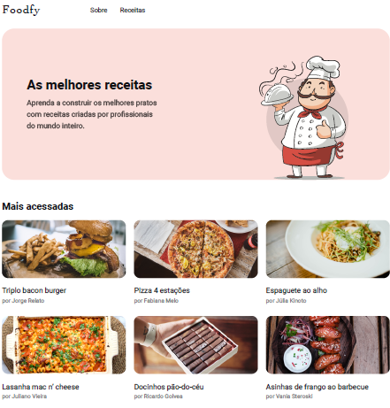

<h1 align="center">Rocketseat</h1>

<h1 align="center"><b>Foodfy</b></h1>

<h1 align="center">
    
</h1>

## About
Foodfy is a project about building a Web Application for recipes.

## Objectives
The **bootcamp** is entirely practical and focused on improving one's coding skills. In addition, it's  goal is having developers practicing html, css and javascript by delivering many challenges along the way.

## Languages used
- Html5 (Hypertext)
- Css3 (Cascading Style Sheet)
- Javascript

## Code information
As the bootcamp progresses, more codes will be uploaded here.
Done so far:
 - Pages Index, About and Recipes were create.
 - Each recipe opens individually in a Modal-Overlay

