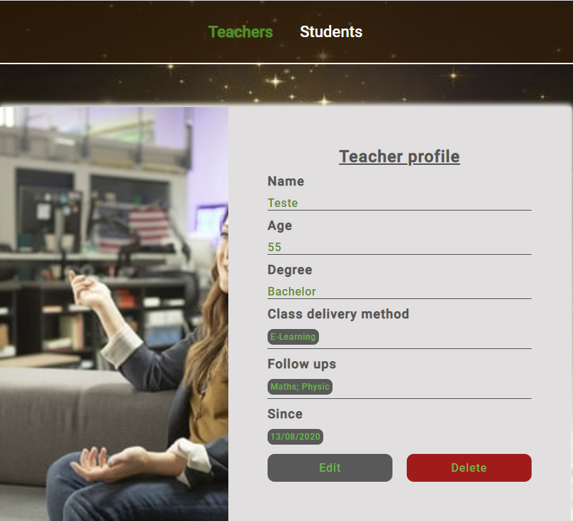

<h1 align="center">Rocketseat</h1>

<h1 align="center"><b>Teachers and Students</b></h1>

<h1 align="center">
    
</h1>

## About - Step 4.4
This is a project is about building a Web Application - Teachers and Students.

## Learning Objectives
This part of the project was about creating "routes" and "pages" to "show" and "edit" Teachers that have been previously created. 

- For page show, functions to properly display "age", "degree" were created. For the follow ups, method "split" was used to generate an array. To properly, display the field "since" the constructor "Intl" was applied. 

- For page edit, we recover the "id" from req.params, validated if teacher existed, then return the teacher data to be edited. To properly display dob, we used method splice.

## Languages used
- Html5 (Hypertext)
- Css3 (Cascading Style Sheet)
- Javascript

## Code information
As the bootcamp progresses, more codes will be uploaded.
The progress is going to be posted by steps accomplished.

