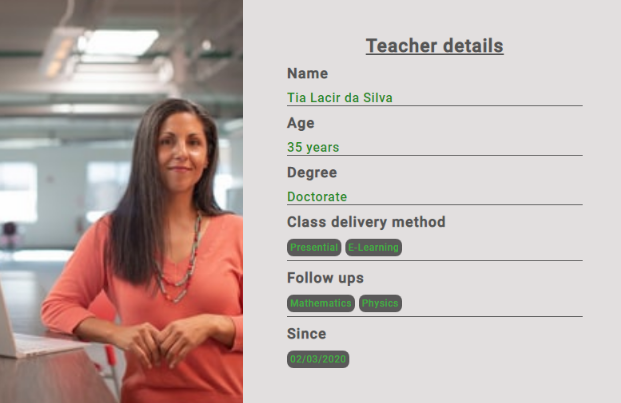
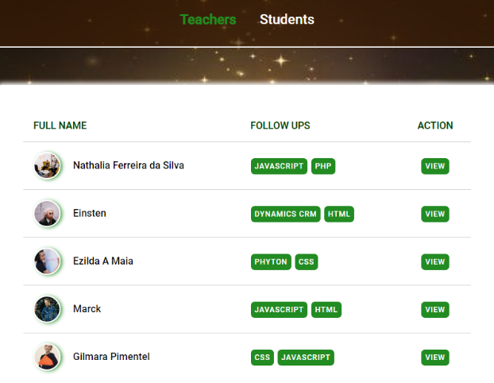

<h1 align="center">Rocketseat</h1>

<h1 align="center"><b>Teachers and Students</b></h1>

<h1 align="center">
Index before changes

       
</h1>
<h1 align="center">
Index with table

       
</h1>

## About - Step 4.6
This is a project is about building a Web Application - Teachers and Students.

## Learning Objectives
- In this part of the project, a change was performed on the index page in order to display the teachers' list on a table. So, created a table to display “Teachers' full name”, “Follow ups” and “Action”. Then data was pulled from backend (at this point it is still data.json file).

- Some adjustments were performed on the route where index page is being rendered, such as use the method "split" to transform the string "teachers.sujbects" into an array, then display subjects individually on the Front end.   

- Created a span for image (avatar) and placed it before the teachers’ name using grid. 

- Proper CSS was applied to style the page. 

 
## Languages / Technologies used
- Html5 (Hypertext)
- Css3 (Cascading Style Sheet)
- Javascript
- Node.js

## Code information
As the bootcamp progresses, more codes will be uploaded.

Done so far:  
- Along the way we have created the Teachers page and its routes, using HTTP method such as GET, POST, PUT and DELETE. 
- Modified teacher's index page to display data into a TABLE. 

