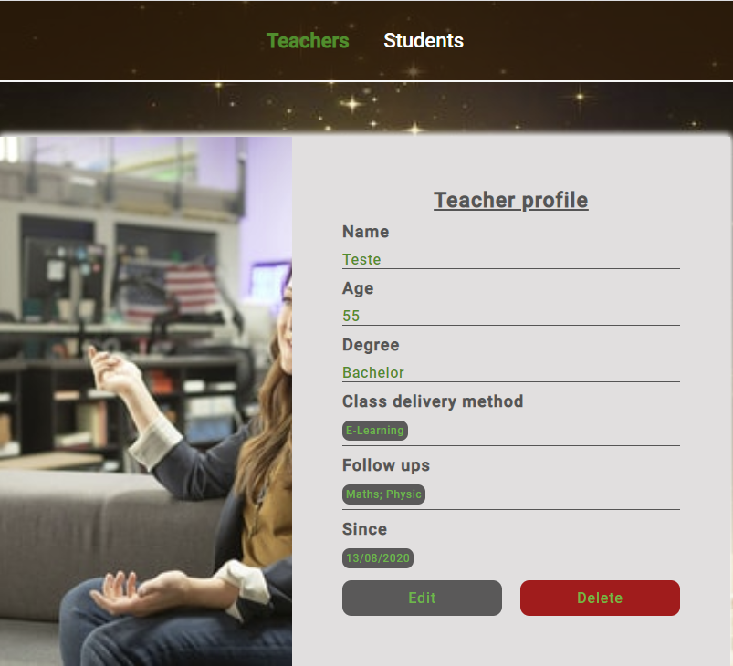

<h1 align="center">Rocketseat</h1>

<h1 align="center"><b>Teachers and Students</b></h1>

<h1 align="center">
    
    
</h1>

## About - Step 4.5
This is a project is about building a Web Application - Teachers and Students.

## Learning Objectives
This part of the project was about creating "routes" to "store" edted teachers' data and to "delete" teachers' data.

To store data, Http method PUT was used:

- Configured the FORM on page EDIT, so PUT can override POST.

- Created a route: routes.put(“/teachers”, teachers.update) 

- Created function “update” in order to save the changes. I extracted the “id” from req.body and formatted it with the constructor “Number”.  
Then, based on the id from req.body, I validated if “teacher” existed on the data.json file and got the index (position on the array where the specific teacher was sitting), then wrote a line of code to have the new information written on the data.json file. 

- P. S:  dob: Date.parse(req.body.dob) was applied, so it will be stored in timestamp. 

 -----------------------------------------------------
To delete data, Http method DELETE was used:

- Created a delete button on page EDIT and placed it aside to edit button.

- Created a link for the delete button so, user will be directed to a page which displays his data on a FORM. On this page it was added another button to Confirm deletion. 

- Configured the FORM, so DELETE can override POST. 

- Created a delete function, that retrieves the req.body, then by the id, I created an array with method "filter" storing in it only teachers that have ids different from the id set for deletion. 

Finally, wrote a line of code to write, this data on the data.json file.  

## Languages / Technologies used
- Html5 (Hypertext)
- Css3 (Cascading Style Sheet)
- Javascript
- Node.js

## Code information
As the bootcamp progresses, more codes will be uploaded.

Done so far:  
Along the way we have created the Teachers page and its routes, using HTTP method such as GET, POST, PUT and DELETE.

